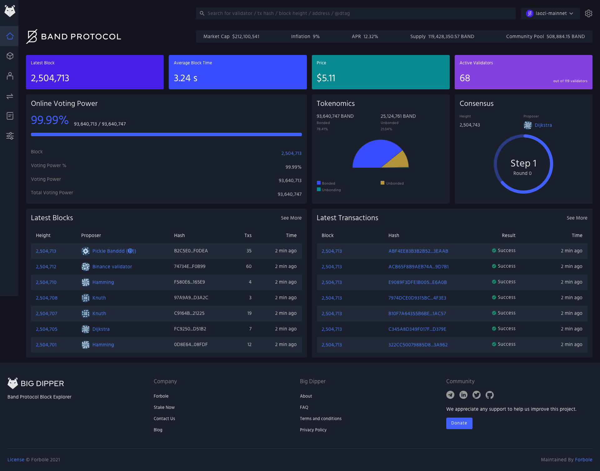
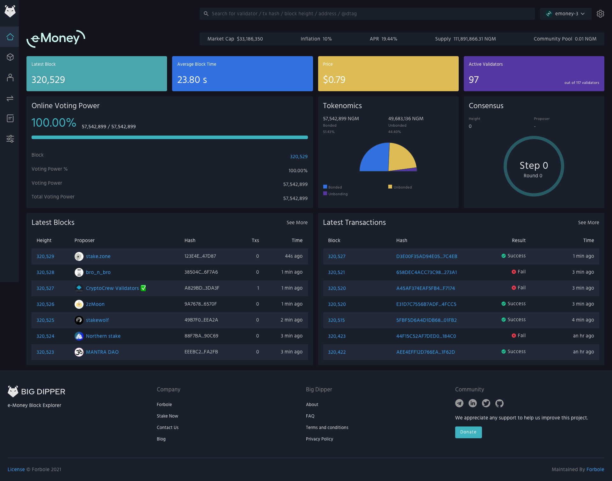

  

  

 

# Themes
Below are all the available themes we are currently using. If the default is not to your liking please feel free to make your own or use one of our alternatives

## Default

  

    <a href="./default/light.ts">
      Light
    <a>
  

  

    
  

  

    <a href="./default/dark.ts">
      Dark
    <a>
  

  

    
  

## Desmos

  

    <a href="./desmos/light.ts">
      Light
    <a>
  

  

    
  

  

    <a href="./desmos/dark.ts">
      Dark
    <a>
  

  

    
  

## Agoric

  

    <a href="./agoric/light.ts">
      Light
    <a>
  

  

    
  

## Band

  

    <a href="./band/light.ts">
      Dark
    <a>
  

  

    
  

## Bitsong

  

    <a href="./bitsong/light.ts">
      Dark
    <a>
  

  

    
  

## E-money

  

    <a href="./emoney/light.ts">
      Dark
    <a>
  

  

    
  

